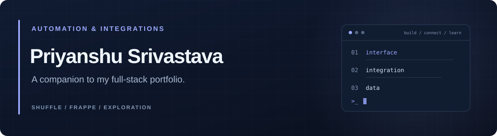

  <a href="https://github.com/ShAdOwMoNaRcH29"><strong>Main portfolio</strong></a> &nbsp; / &nbsp;
  <a href="https://www.linkedin.com/in/priyanshu-srivastava-a18b27238/">LinkedIn</a> &nbsp; / &nbsp;
  <a href="https://github.com/ShAdOwMoNaRcH29/kanban-react">React project</a>

### Hi, I'm Priyanshu.

I'm focused on **full-stack development**. This is my companion account for Shuffle and Frappe-related repositories, with an emphasis on exploring automation and integrations.

**Looking for my portfolio?** Start at [ShAdOwMoNaRcH29 →](https://github.com/ShAdOwMoNaRcH29)

### Explore this workspace

| Repository | What you'll find |
| :--- | :--- |
| [Shuffle](https://github.com/PriyanshuSri2903/Shuffle) | A workspace combining upstream Shuffle platform code and app integrations. |
| [shuffle-ldap3](https://github.com/PriyanshuSri2903/shuffle-ldap3) | A fork of the Shuffle automation platform. |
| [python-apps](https://github.com/PriyanshuSri2903/python-apps) | A fork of Shuffle's Python app integrations. |
| [helpdesk](https://github.com/PriyanshuSri2903/helpdesk) | A Frappe/Helpdesk bench workspace. |

These repositories include upstream projects and forks. Credit for the original platforms belongs to their respective maintainers: [Shuffle](https://github.com/Shuffle) and [Frappe](https://github.com/frappe).

### Elsewhere in my portfolio

**[React Kanban Board](https://github.com/ShAdOwMoNaRcH29/kanban-react)** — a React interface that fetches API data and groups tickets by workflow status.

**[Python Classification Notebooks](https://github.com/ShAdOwMoNaRcH29/jubilant-octo-system)** — learning projects using pandas, NumPy, and scikit-learn.

---

  <strong>Interested in full-stack developer opportunities.</strong> 
  <a href="https://www.linkedin.com/in/priyanshu-srivastava-a18b27238/">Let's connect on LinkedIn</a>

